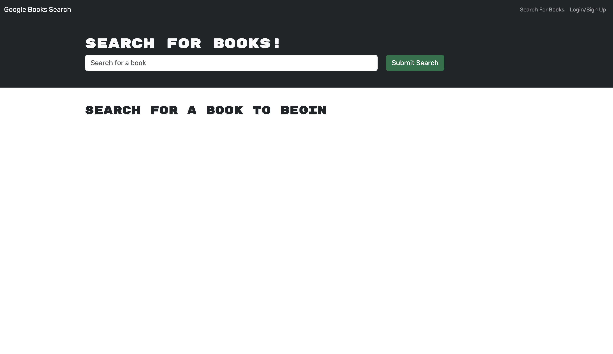

# Book Search Engine

## Description
This is a book search engine using the Google Books API. It allows users to search for books and save them to their account. It uses GraphQL to query the database and Apollo Server to fetch the data.

## Deployed Application

[Click Me!]()

## Table of Contents
- [Installation](#installation)
- [Usage](#usage)
- [License](#license)
- [Contributing](#contributing)
- [Tests](#tests)
- [Questions](#questions)
## Installation
To host this application locally, clone the repository and run `npm install` to install the dependencies. Then run `npm run build` to build the application. Finally, run `npm run develop` to start the server. The application will be hosted at `localhost:3000` by default.
## Usage
To use the application, navigate to the homepage and create an account. Once you have an account, you can search for books and save them to your account. You can also view your saved books and delete them from your account. You can also click on the link to the Google Books page for each book to view more information about it.
## License
    This project is licensed under the MIT license.
## Contributing
I am not currently accepting contributions for this project. But feel free to clone the repository and make changes for personal use.
## Tests
No tests are currently included with this project.
## Questions
If you have any questions, please contact me at harrisonminer59@gmail.com or visit my GitHub page at https://github.com/DrBubblez.
